<!-- ========================================================= -->

<!-- Multi-LLM Agent Platform README -->

<!-- Version: 2.0 -->

<!-- Author: Prince Giri -->

<!-- ========================================================= -->

<div align="center">


# 🚀 Multi-LLM Agent Platform

### Production-Ready AI Orchestration Platform powered by FastAPI, React & Multiple Large Language Models

<br>


<br>

**An intelligent AI platform that integrates multiple Large Language Models into a single, scalable application with intelligent routing, response aggregation, persistent memory, web search, and a modern React interface.**

---

### 🌐 Project Links

| Resource          | Link                                              |
| ----------------- | ------------------------------------------------- |
| GitHub Repository | https://github.com/Prince11-dev/multi-llm-agent   |
| Portfolio         | https://prince11-dev.github.io/Prince-port/       |
| LinkedIn          | https://www.linkedin.com/in/prince-giri-2985281a9 |

</div>

---

# 📖 Table of Contents

* Overview
* Why Multi-LLM Agent?
* Key Features
* Technology Stack
* Screenshots
* Architecture
* System Workflow
* Project Structure
* Backend Architecture
* Frontend Architecture
* Memory System
* Intelligent Routing
* Multi-LLM Aggregation
* Provider Layer
* REST API Documentation
* Installation
* Environment Variables
* Running the Project
* Testing
* Continuous Integration
* Docker
* Performance
* Security
* Roadmap
* Contributing
* License
* References
* About the Developer

---

# 🌟 Overview

**Multi-LLM Agent Platform** is a production-inspired AI application that demonstrates how multiple Large Language Models can be orchestrated through a single, modular backend.

Instead of relying on a single provider, the platform integrates multiple state-of-the-art models—including **OpenAI**, **Google Gemini**, **Groq**, and **DeepSeek**—behind a unified architecture.

The backend is built with **FastAPI**, exposing a REST API that supports:

* Intelligent model routing
* Multi-model response aggregation
* Persistent conversation memory
* External web search
* Modular provider integration

The frontend is implemented with **React** and **Vite**, providing a clean and responsive interface for interacting with the platform.

This project focuses on engineering practices that are commonly found in modern AI applications:

* Layered architecture
* Asynchronous programming
* Modular service design
* Provider abstraction
* Environment-based configuration
* Continuous Integration using GitHub Actions
* Extensibility for future AI capabilities

---

# 🎯 Why This Project?

Modern AI applications increasingly combine multiple LLM providers rather than depending on a single model.

Each provider offers different strengths:

| Provider | Primary Strength                                       |
| -------- | ------------------------------------------------------ |
| OpenAI   | High-quality reasoning and general-purpose responses   |
| Gemini   | Long-context understanding and multimodal capabilities |
| Groq     | Extremely fast inference                               |
| DeepSeek | Cost-efficient reasoning and coding tasks              |

Instead of forcing users to manually choose a provider, this platform demonstrates how an application can intelligently orchestrate multiple models behind a single API.

The project was designed to answer several engineering questions:

* How can multiple AI providers share a common interface?
* How can requests be routed intelligently?
* How can responses from several providers be combined?
* How can conversation history be preserved?
* How can the system remain extensible as new providers become available?

---

# ✨ Key Features

## 🤖 Multi-LLM Integration

Supports multiple AI providers through a unified provider layer.

Current integrations include:

* OpenAI
* Google Gemini
* Groq
* DeepSeek

The provider abstraction makes it straightforward to add future integrations such as Claude, Mistral, Cohere, Azure OpenAI, or locally hosted models.

---

## 🧠 Intelligent Model Routing

Not every request benefits from the same model.

The Intelligent Router analyzes incoming prompts and selects the most appropriate provider based on characteristics such as reasoning complexity, latency requirements, and provider strengths.

This enables more efficient use of AI resources while maintaining a consistent user experience.

---

## 🔀 Multi-Model Response Aggregation

Instead of relying on a single provider, the platform can query multiple models concurrently.

Responses are collected, evaluated, and synthesized into a final answer, demonstrating a common orchestration pattern used in advanced AI systems.

Benefits include:

* Improved response quality
* Increased reliability
* Provider redundancy
* Easier benchmarking across models

---

## 💬 Persistent Conversation Memory

Conversation history is stored using SQLite, allowing the application to maintain context across requests.

Each interaction is associated with a session identifier, enabling context-aware conversations without requiring external memory services.

---

## 🌐 Web Search Integration

The platform can supplement model knowledge with real-time web search results when up-to-date information is required.

This extends the usefulness of the assistant beyond the knowledge cutoff of individual language models.

---

## ⚡ FastAPI Backend

The backend exposes a high-performance REST API built with FastAPI.

Key characteristics include:

* Asynchronous request handling
* Automatic OpenAPI documentation
* Modular routing
* Environment-based configuration
* Middleware support
* Dependency injection

---

## 🎨 Modern React Frontend

The frontend is developed using React and Vite, providing a responsive interface for interacting with the platform.

The design emphasizes simplicity, readability, and quick interaction with the AI services.

---

## 🧩 Modular Architecture

The project separates responsibilities into dedicated modules, including:

* Services
* Providers
* Memory
* Middleware
* Tools
* Utilities
* Schemas

This structure promotes maintainability, scalability, and ease of testing.

---

## 🧪 Continuous Integration

Every push and pull request is validated through GitHub Actions.

The workflow currently performs:

* Dependency installation
* Backend verification
* Automated tests
* Frontend build validation

This ensures that the repository remains in a healthy, deployable state.

---
# 🛠 Technology Stack

The Multi-LLM Agent Platform combines modern backend technologies, AI provider SDKs, frontend tooling, and continuous integration practices to deliver a scalable and maintainable application.

---

## Backend

| Technology  | Purpose                      |
| ----------- | ---------------------------- |
| Python 3.12 | Primary programming language |
| FastAPI     | REST API framework           |
| Uvicorn     | ASGI server                  |
| SQLAlchemy  | Database ORM                 |
| SQLite      | Conversation persistence     |
| Pydantic    | Data validation              |
| AsyncIO     | Concurrent request handling  |

---

## Artificial Intelligence

| Provider      | SDK                   |
| ------------- | --------------------- |
| OpenAI        | OpenAI Python SDK     |
| Google Gemini | Google GenAI SDK      |
| Groq          | Groq SDK              |
| DeepSeek      | OpenAI Compatible SDK |

---

## Frontend

| Technology | Purpose        |
| ---------- | -------------- |
| React      | User Interface |
| Vite       | Build Tool     |
| JavaScript | Frontend Logic |
| CSS        | Styling        |

---

## DevOps

| Tool           | Purpose                     |
| -------------- | --------------------------- |
| Git            | Version Control             |
| GitHub         | Repository Hosting          |
| GitHub Actions | Continuous Integration      |
| Pytest         | Testing Framework           |
| Docker         | Containerization (Upcoming) |

---

# 📊 Engineering Metrics

| Metric                | Value              |
| --------------------- | ------------------ |
| Backend Framework     | FastAPI            |
| Frontend Framework    | React              |
| Programming Languages | Python, JavaScript |
| AI Providers          | 4                  |
| REST Endpoints        | 7                  |
| Middleware Components | 2                  |
| Memory Engine         | SQLite             |
| Test Framework        | Pytest             |
| CI Pipeline           | GitHub Actions     |
| License               | MIT                |

---

# 📸 Application Preview

The following screenshots demonstrate the primary capabilities of the platform.

---

## 🏠 Dashboard

The landing page provides a clean interface for interacting with multiple AI providers.

<p align="center">
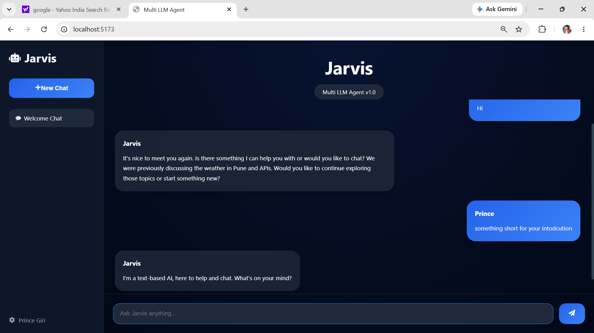
</p>

---

## 💬 Chat Interface

Users can submit prompts and receive AI-generated responses through a responsive chat interface.

<p align="center">
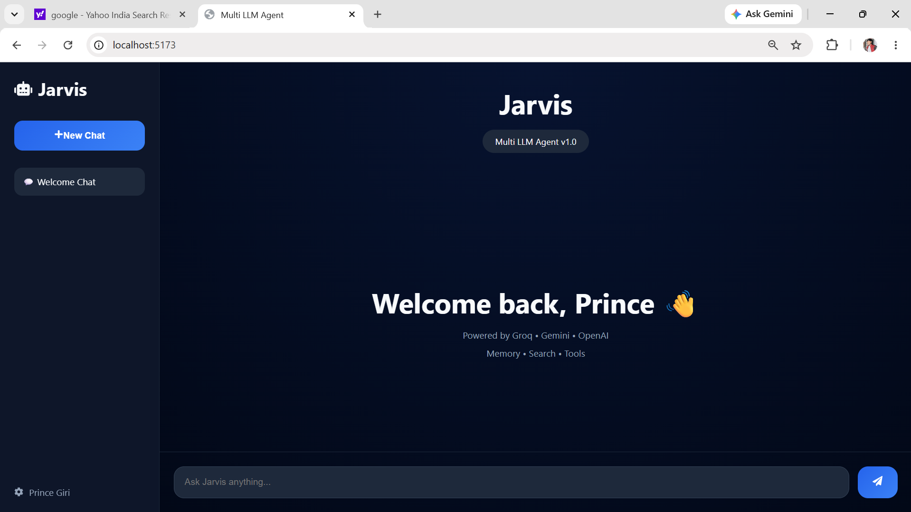
</p>

---

## 📚 API Documentation

FastAPI automatically generates interactive API documentation.

<p align="center">
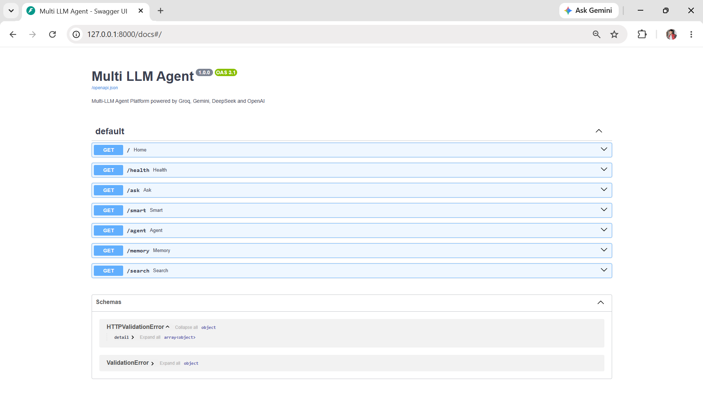
</p>

---

## ✅ Continuous Integration

GitHub Actions automatically validates every push to the repository.

<p align="center">
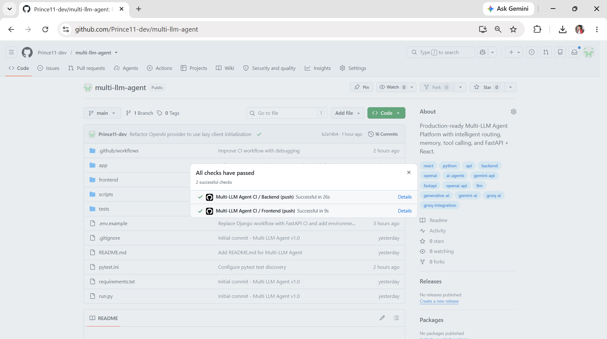
</p>

---

## 🤖 Multi-LLM Aggregation Endpoint

The `/ask` endpoint queries multiple providers and synthesizes a unified response.

<p align="center">
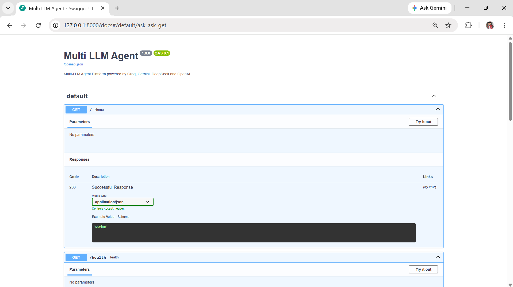
</p>

---

# 🎥 Live Demonstration

A short demonstration of the application can be viewed below.

<p align="center">


</p>

> **Tip:** Recording a 10–20 second GIF showing the dashboard, asking a question, receiving a response, and opening Swagger provides visitors with an immediate understanding of the project.

---

# 🏗 System Architecture

<p align="center">


</p>

The architecture is divided into multiple logical layers to maximize modularity, maintainability, and scalability.

Each layer has a clearly defined responsibility, minimizing coupling between components.

---

## Architectural Goals

The project was designed around the following engineering principles:

* Separation of Concerns
* Modular Design
* Reusable Components
* Asynchronous Programming
* Scalability
* Extensibility
* Clean API Design
* Provider Abstraction
* Environment-based Configuration

---

# 🧩 High-Level Component Diagram

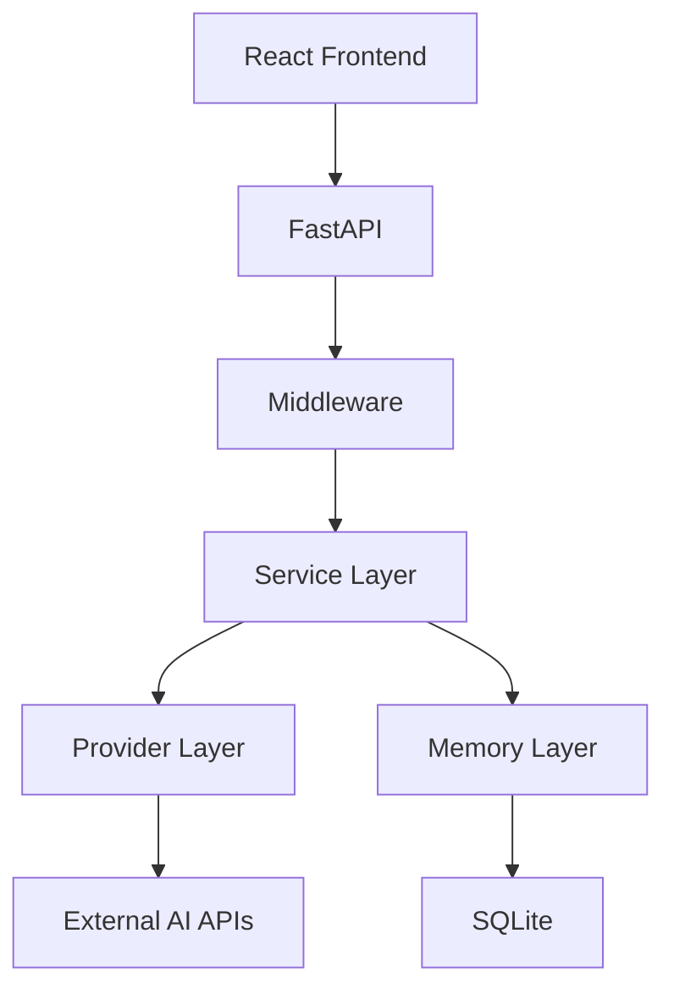

---

# 🔄 Request Lifecycle

Every request follows a structured execution pipeline.

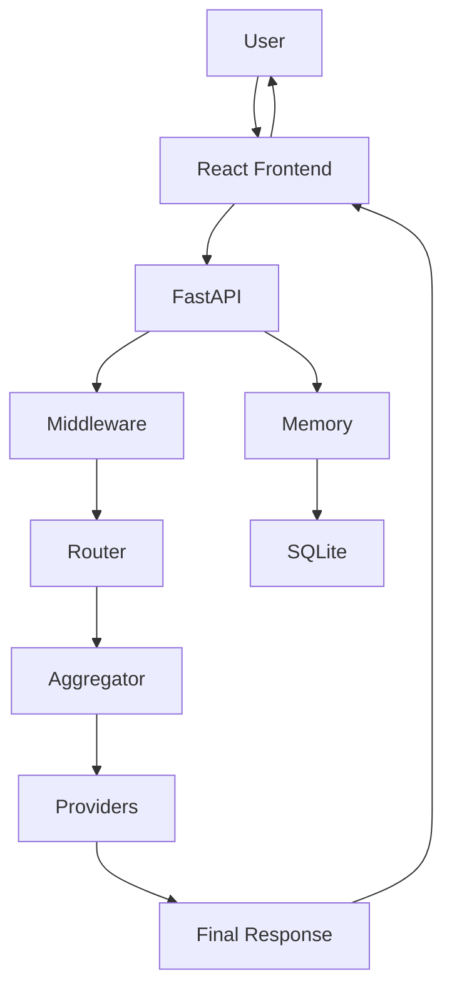

---

## Request Processing Steps

1. The user submits a prompt through the React interface.

2. The frontend sends an HTTP request to the FastAPI backend.

3. Middleware records request metadata and applies global processing.

4. Previous conversation history is retrieved from SQLite.

5. The Intelligent Router determines the execution strategy.

6. The Aggregator invokes one or more AI providers concurrently.

7. Responses are collected and synthesized into a final answer.

8. The completed interaction is stored in memory.

9. The backend returns the response to the frontend.

10. The frontend renders the answer to the user.

---

# 📂 Repository Structure

```text
multi-llm-agent/
│
├── .github/
│   └── workflows/
│       └── ci.yml
│
├── app/
│   ├── memory/
│   ├── middleware/
│   ├── providers/
│   ├── schemas/
│   ├── services/
│   ├── tools/
│   ├── utils/
│   ├── config.py
│   └── main.py
│
├── frontend/
│
├── screenshots/
│
├── scripts/
│
├── tests/
│
├── .env.example
├── README.md
├── requirements.txt
├── Dockerfile
├── docker-compose.yml
└── LICENSE
```

---

# 📁 Directory Overview

| Directory   | Responsibility               |
| ----------- | ---------------------------- |
| app         | Backend application          |
| services    | Business logic               |
| providers   | AI integrations              |
| memory      | Conversation persistence     |
| middleware  | Logging & exception handling |
| tools       | External utilities           |
| schemas     | API models                   |
| frontend    | React application            |
| tests       | Automated tests              |
| screenshots | README assets                |
| .github     | GitHub Actions workflows     |

---

# 🏛 Backend Design Philosophy

Rather than placing business logic inside API routes, the backend delegates all complex operations to specialized service modules.

This approach provides:

* Better maintainability
* Improved readability
* Easier testing
* Lower coupling
* Higher scalability

Each module has a single responsibility, making future enhancements significantly easier.

# ⚙️ Backend Architecture

The backend of the **Multi-LLM Agent Platform** is built using **FastAPI**, following a modular, service-oriented architecture.

Instead of embedding business logic directly into API endpoints, responsibilities are distributed across dedicated modules responsible for routing, orchestration, persistence, middleware, provider integrations, and utility functions.

This architecture improves:

- Maintainability
- Testability
- Scalability
- Code Reusability
- Separation of Concerns

---

## Backend Layer Overview

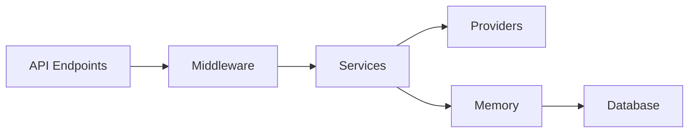

---

# 🚀 FastAPI Application

The application entry point is:

```
app/main.py
```

Responsibilities include:

- Initializing the FastAPI application
- Configuring CORS
- Registering middleware
- Loading environment variables
- Initializing SQLite
- Registering REST endpoints
- Global exception handling

---

# 🧩 Service Layer

The Service Layer contains all core business logic.

Location

```
app/services/
```

Current Services

| Service | Responsibility |
|----------|----------------|
| Aggregator | Executes multiple providers concurrently |
| Synthesizer | Produces the final AI response |
| Intelligent Router | Chooses the optimal provider |
| Intelligent Executor | Executes selected provider |
| Router | Basic routing implementation |
| Router Executor | Executes routed requests |
| Stream Service | Planned streaming responses |

---

## Why a Service Layer?

Keeping business logic outside the API layer provides several advantages.

Instead of:

```
Endpoint

↓

Business Logic

↓

Provider
```

the project uses

```
Endpoint

↓

Service

↓

Provider
```

Benefits include:

- Cleaner API routes
- Better testing
- Higher reusability
- Easier maintenance
- Simpler debugging

---

# 🔌 Provider Layer

Every AI provider is isolated inside its own module.

```
app/providers/
```

Current providers include

- OpenAI
- Google Gemini
- Groq
- DeepSeek

Every provider follows the same contract.

Example

```python
await ask_provider(question)
```

returns

```python
{
    "provider": "...",
    "answer": "...",
    "time": 0.52,
    "success": True
}
```

Because every provider returns the same structure, higher-level services do not need provider-specific logic.

---

# 🔄 Lazy Client Initialization

One significant architectural improvement is **lazy initialization** of provider SDKs.

Instead of creating clients when modules are imported, each provider creates its client only when handling a request.

Workflow

```
Application Starts

↓

No API Client Created

↓

Request Received

↓

Provider Selected

↓

Create Client

↓

Execute Request
```

Advantages

- Faster startup
- No import-time API key failures
- Better CI compatibility
- Reduced resource usage
- Cleaner dependency lifecycle

---

# 🤖 AI Provider Workflow

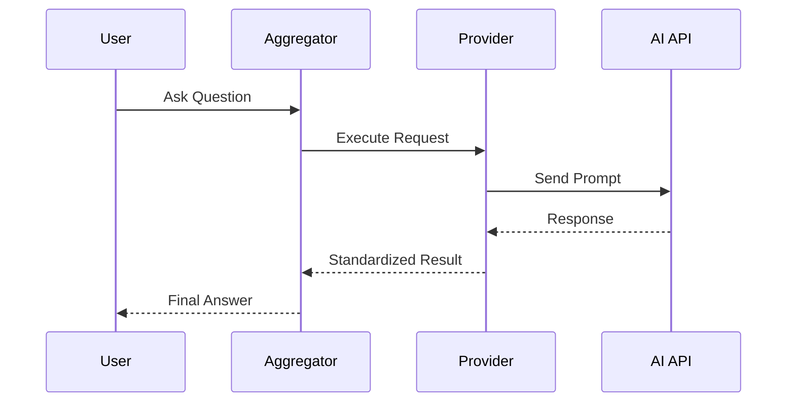

---

# 🔀 Multi-LLM Aggregation

The Aggregator is one of the central components of the platform.

Instead of relying on a single provider, multiple AI models can be queried simultaneously.

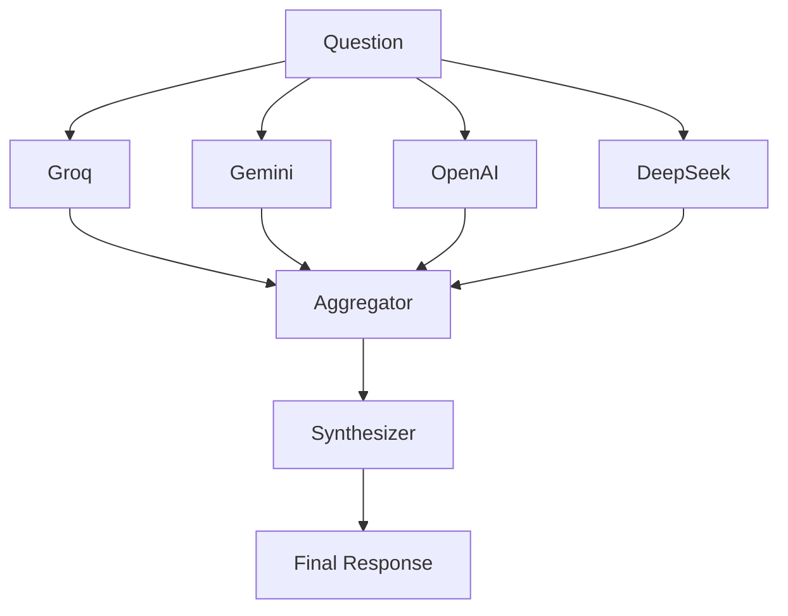

Benefits

- Higher quality responses
- Better reliability
- Cross-model comparison
- Provider redundancy
- Lower vendor dependency

---

# 🧠 Intelligent Routing

Not every question requires every provider.

The Intelligent Router analyzes incoming prompts before execution.

Routing considers:

- Question complexity
- Expected reasoning depth
- Latency
- Provider specialization
- Future cost optimization

Example flow

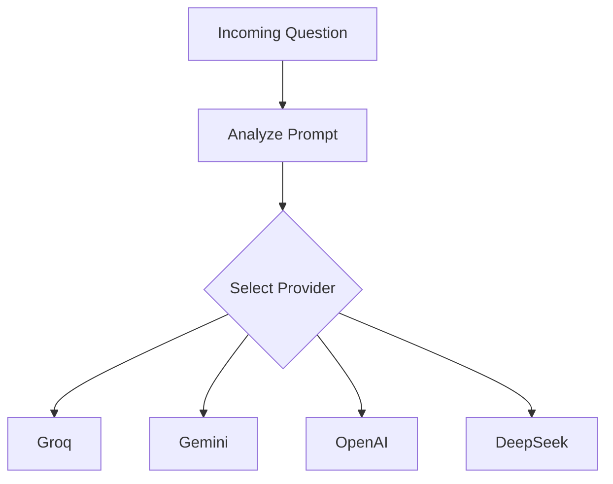

Future improvements include:

- ML-based routing
- Confidence scoring
- Token estimation
- Cost-aware provider selection
- User preferences

---

# 💾 Conversation Memory

The platform maintains persistent conversations using SQLite.

Each interaction is stored together with:

- Session ID
- User Question
- AI Response
- Timestamp

Memory workflow

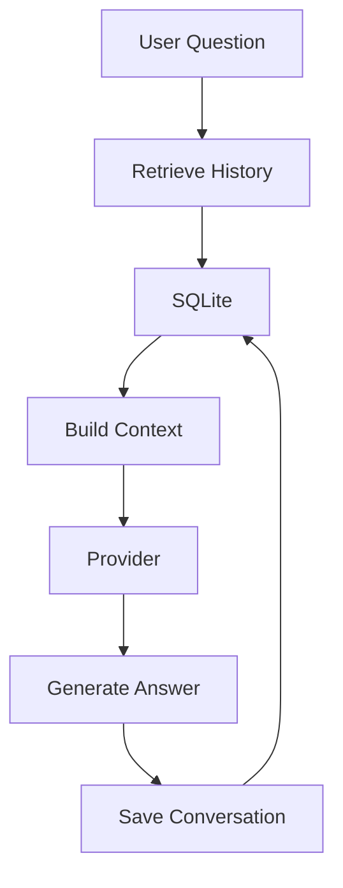

Advantages

- Context-aware conversations
- Multi-session support
- Lightweight persistence
- Easy migration to PostgreSQL

---

# 🗄️ Database Layer

SQLite is intentionally used because it provides:

- Zero configuration
- Lightweight deployment
- Fast local development
- Reliable persistence
- Cross-platform compatibility

Future database support

- PostgreSQL
- MySQL
- MariaDB
- SQL Server

---

# 🌍 Tool Layer

The platform is designed to integrate external tools alongside AI providers.

Current tools

- Web Search
- Calculator
- Search Executor

Planned integrations

- Weather API
- News API
- PDF Processing
- Code Interpreter
- File Search
- Email Integration
- Calendar Integration

This architecture enables the platform to evolve into a complete AI assistant capable of interacting with external systems.

---

# 🎨 Frontend Architecture

The frontend is implemented using **React** and **Vite**.

Design principles

- Component-based architecture
- Responsive layout
- Fast rendering
- Simple navigation
- Clean user experience

Responsibilities

- User interaction
- API communication
- Rendering AI responses
- Managing conversations
- Displaying system status

---

## Frontend Workflow

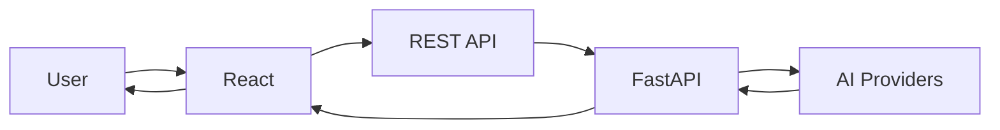

---

# 🔒 Middleware

Middleware provides reusable functionality across the application.

Current middleware

- Logging Middleware
- Global Exception Handler

Future middleware

- JWT Authentication
- Rate Limiting
- Request Metrics
- Security Headers
- Request Tracing

---

# 🏗️ Design Principles

The project follows several software engineering principles.

| Principle | Purpose |
|-----------|---------|
| Separation of Concerns | Independent modules |
| DRY | Reduce duplicated logic |
| SOLID | Maintainable object-oriented design |
| Async Programming | High concurrency |
| Provider Abstraction | Easy integration of new LLMs |
| Dependency Isolation | Simplified testing |
| Modular Architecture | Independent components |
| Environment Configuration | Secure secret management |

These principles make the platform easy to extend while keeping the codebase organized and maintainable.

---
# 🌐 REST API Documentation

The Multi-LLM Agent Platform exposes a RESTful API built with **FastAPI**. All endpoints return JSON responses and are documented automatically through OpenAPI (Swagger UI).

---

## Base URL

### Local Development

```
http://127.0.0.1:8000
```

### Interactive API Documentation

Swagger UI

```
http://127.0.0.1:8000/docs
```

ReDoc

```
http://127.0.0.1:8000/redoc
```

---

# API Endpoints

| Endpoint | Method | Description |
|-----------|---------|-------------|
| `/` | GET | Root endpoint |
| `/health` | GET | Health check |
| `/ask` | GET | Multi-LLM aggregation |
| `/smart` | GET | Intelligent routing |
| `/agent` | GET | AI Agent with conversation memory |
| `/memory` | GET | Retrieve conversation history |
| `/search` | GET | Web search integration |

---

# 🏠 Root Endpoint

Returns the application status.

### Request

```http
GET /
```

### Example Response

```json
{
  "message": "Multi LLM Agent Running",
  "version": "1.0.0"
}
```

Status Codes

| Code | Meaning |
|------|----------|
|200|Application running|

---

# ❤️ Health Check

Returns application status and available capabilities.

### Request

```http
GET /health
```

### Response

```json
{
  "status":"healthy",
  "version":"1.0.0",
  "providers":[
      "groq",
      "gemini",
      "deepseek",
      "openai"
  ],
  "features":[
      "memory",
      "routing",
      "aggregation",
      "tools"
  ]
}
```

---

# 🤖 Multi-LLM Aggregation

```
GET /ask
```

Queries multiple AI providers simultaneously.

### Parameters

| Name | Type | Required | Description |
|------|------|----------|-------------|
|question|string|Yes|Prompt from the user|

### Example

```http
GET /ask?question=What is FastAPI?
```

### Response

```json
{
  "question":"What is FastAPI?",
  "responses":[
      ...
  ],
  "final":"FastAPI is a modern Python framework..."
}
```

---

# 🧠 Intelligent Routing

```
GET /smart
```

Routes the request to the most appropriate AI provider.

### Example

```http
GET /smart?question=Explain Quantum Computing
```

Example Response

```json
{
   "selected_model":"gemini",
   "answer":"..."
}
```

---

# 💬 AI Agent

```
GET /agent
```

Maintains persistent conversation history.

### Parameters

| Parameter | Description |
|------------|-------------|
|question|User prompt|
|session_id|Conversation identifier|

Example

```http
GET /agent?question=Hello&session_id=prince
```

Example Response

```json
{
   "session_id":"prince",
   "history_count":12,
   "answer":"Hello! How can I help you today?"
}
```

---

# 💾 Conversation Memory

```
GET /memory
```

Retrieves previous conversation history.

Example

```http
GET /memory?session_id=prince
```

Response

```json
{
   "count":12,
   "history":[
      ...
   ]
}
```

---

# 🌍 Web Search

```
GET /search
```

Searches the web using integrated search tools.

Example

```http
GET /search?question=Latest AI News
```

---

# ⚙ Environment Variables

Create a `.env` file in the project root.

```env
OPENAI_API_KEY=

GROQ_API_KEY=

GEMINI_API_KEY=

DEEPSEEK_API_KEY=
```

Never commit your API keys.

The repository includes:

```
.env.example
```

to simplify configuration.

---

# 🚀 Installation Guide

## Clone Repository

```bash
git clone https://github.com/Prince11-dev/multi-llm-agent.git

cd multi-llm-agent
```

---

## Create Virtual Environment

### Windows

```bash
python -m venv venv

venv\Scripts\activate
```

### Linux

```bash
python3 -m venv venv

source venv/bin/activate
```

### macOS

```bash
python3 -m venv venv

source venv/bin/activate
```

---

## Install Dependencies

```bash
pip install -r requirements.txt
```

---

## Configure Environment

Copy

```
.env.example
```

to

```
.env
```

Then add your API keys.

---

# ▶ Running the Backend

Start the FastAPI application.

```bash
python -m uvicorn app.main:app --reload
```

Backend URL

```
http://127.0.0.1:8000
```

Swagger

```
http://127.0.0.1:8000/docs
```

ReDoc

```
http://127.0.0.1:8000/redoc
```

---

# 🎨 Running the Frontend

Navigate to the frontend directory.

```bash
cd frontend
```

Install dependencies.

```bash
npm install
```

Start the development server.

```bash
npm run dev
```

Open

```
http://localhost:5173
```

---

# 🧪 Running Tests

Execute all automated tests.

```bash
python -m pytest -v
```

Expected output

```
=============================

2 passed

=============================
```

---

# 📦 Project Dependencies

Major backend libraries

- FastAPI
- Uvicorn
- SQLAlchemy
- Pydantic
- OpenAI SDK
- Google GenAI SDK
- Groq SDK
- HTTPX
- BeautifulSoup4
- DuckDuckGo Search
- Pytest

Frontend

- React
- Vite
- JavaScript

---

# 🔄 Continuous Integration

Every push and pull request automatically triggers the GitHub Actions workflow.

Pipeline stages

1. Checkout Repository

2. Setup Python

3. Install Dependencies

4. Verify Backend Imports

5. Execute Tests

6. Setup Node.js

7. Install Frontend Dependencies

8. Build React Application

Workflow file

```
.github/workflows/ci.yml
```

---

## CI Workflow

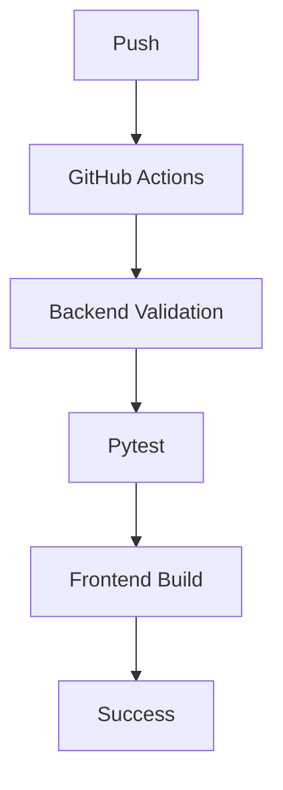

---

# 🐳 Docker

The project is container-ready.

## Build the image

```bash
docker build -t multi-llm-agent .
```

## Run the container

```bash
docker run -d \
-p 8000:8000 \
--env-file .env \
multi-llm-agent
```

## Using Docker Compose

```bash
docker compose up --build
```

This starts the backend using the environment variables defined in `.env`.

---

# ☁ Deployment

The application can be deployed to a variety of cloud platforms.

Recommended options

- Render
- Railway
- Fly.io
- AWS EC2
- Azure App Service
- Google Cloud Run
- DigitalOcean App Platform

For production deployments, it is recommended to:

- Use PostgreSQL instead of SQLite.
- Store secrets using the platform's secret manager.
- Run behind a reverse proxy such as Nginx.
- Enable HTTPS.
- Configure health checks and monitoring.

---

# ⚡ Performance

The platform is designed around asynchronous execution.

Key optimizations include:

- Async FastAPI endpoints
- Concurrent provider requests
- Lightweight SQLite persistence
- Lazy initialization of AI clients
- Modular service execution

These choices reduce startup overhead and improve response times, particularly when aggregating results from multiple providers.

# 🔒 Security

Security has been considered throughout the design of the Multi-LLM Agent Platform.

Although this project is primarily intended for learning and demonstration purposes, it follows several best practices commonly used in production applications.

---

## Current Security Practices

✅ Environment Variables

Sensitive API keys are never hardcoded.

All secrets are loaded from:

```
.env
```

using environment-based configuration.

---

✅ Lazy Client Initialization

AI provider clients are initialized only when required.

Benefits include:

- Prevents application startup failures
- Reduces unnecessary resource allocation
- Improves CI compatibility
- Avoids accidental credential exposure

---

✅ Centralized Configuration

All application configuration is managed from a single location.

```
app/config.py
```

This simplifies maintenance while reducing duplicated configuration logic.

---

## Planned Security Enhancements

Future releases will include:

- JWT Authentication
- OAuth2 Login
- API Rate Limiting
- Role-Based Access Control (RBAC)
- HTTPS Enforcement
- Secret Management
- Request Validation
- Audit Logging
- API Usage Monitoring

---

# 📈 Performance Considerations

The project has been designed with scalability in mind.

Current optimizations include:

- Asynchronous FastAPI endpoints
- Concurrent provider execution
- Modular service architecture
- SQLite persistence
- Lazy provider initialization

Potential future optimizations include:

- Redis caching
- Response streaming
- Background task queues
- Connection pooling
- Distributed deployments
- Horizontal scaling

---

# 🗺️ Roadmap

The roadmap outlines planned improvements and future capabilities.

---

## ✅ Version 1.0 (Current)

- Multi-LLM Support
- FastAPI Backend
- React Frontend
- SQLite Memory
- Intelligent Routing
- Response Aggregation
- Web Search
- GitHub Actions
- Automated Testing

---

## 🚀 Version 2.0

Planned improvements:

- Docker Support
- Docker Compose
- PostgreSQL
- Redis Cache
- Authentication
- User Profiles
- Session Dashboard
- Improved UI
- Streaming Responses

---

## 🤖 Version 3.0

Advanced AI capabilities:

- Retrieval-Augmented Generation (RAG)
- Vector Database
- PDF Chat
- Image Analysis
- Voice Input
- AI Tool Calling
- Multi-Agent Collaboration
- Prompt Templates

---

## ☁️ Version 4.0

Production-ready deployment:

- Kubernetes
- Helm Charts
- AWS
- Azure
- Google Cloud
- Monitoring
- Prometheus
- Grafana
- OpenTelemetry
- Centralized Logging

---

# 🤝 Contributing

Contributions are welcome.

If you would like to improve the project:

## Step 1

Fork the repository.

---

## Step 2

Create a new feature branch.

```bash
git checkout -b feature/amazing-feature
```

---

## Step 3

Commit your changes.

```bash
git commit -m "Add amazing feature"
```

---

## Step 4

Push your branch.

```bash
git push origin feature/amazing-feature
```

---

## Step 5

Open a Pull Request.

---

## Contribution Guidelines

Please ensure:

- Code is documented.
- Tests pass successfully.
- CI workflow succeeds.
- API keys are never committed.
- Commit messages are meaningful.
- Pull requests include a clear description.

---

# 📜 License

This project is licensed under the **MIT License**.

You are free to:

- Use
- Modify
- Distribute
- Fork
- Commercially use

the project, provided that the original license and copyright notice are retained.

See the `LICENSE` file for the complete license text.

---

# 📚 References

The following official resources were used during development.

| Technology | Official Documentation |
|------------|------------------------|
| FastAPI | https://fastapi.tiangolo.com |
| React | https://react.dev |
| Vite | https://vitejs.dev |
| SQLAlchemy | https://docs.sqlalchemy.org |
| OpenAI API | https://platform.openai.com/docs |
| Google Gemini API | https://ai.google.dev |
| Groq API | https://console.groq.com/docs |
| DeepSeek API | https://api-docs.deepseek.com |
| Pytest | https://docs.pytest.org |
| GitHub Actions | https://docs.github.com/actions |
| Uvicorn | https://www.uvicorn.org |
| Pydantic | https://docs.pydantic.dev |

---

# ❓ Frequently Asked Questions

## Which AI models are currently supported?

The platform currently supports:

- OpenAI
- Google Gemini
- Groq
- DeepSeek

The architecture makes it straightforward to integrate additional providers.

---

## Can I add Claude, Mistral, or Ollama?

Yes.

Simply create a new provider inside:

```
app/providers/
```

and implement the standard provider interface.

---

## How is conversation history stored?

Conversation history is stored using SQLite.

Each interaction includes:

- Session ID
- User Prompt
- AI Response
- Timestamp

---

## Does the application require all API keys?

No.

Providers use lazy initialization.

Only the provider being invoked requires a valid API key.

---

## Why FastAPI?

FastAPI was selected because it provides:

- Excellent performance
- Automatic OpenAPI documentation
- Native async support
- Type safety
- Strong ecosystem

---

# 📊 Repository Statistics

| Category | Value |
|----------|-------|
| Programming Languages | Python, JavaScript |
| Backend Framework | FastAPI |
| Frontend Framework | React |
| Build Tool | Vite |
| AI Providers | 4 |
| REST Endpoints | 7 |
| Middleware Components | 2 |
| Services | 8+ |
| Database | SQLite |
| Test Framework | Pytest |
| CI/CD | GitHub Actions |
| License | MIT |

---

# 🎯 Learning Outcomes

Building this platform strengthened practical knowledge in:

- Backend Development
- REST API Design
- FastAPI
- React
- GitHub Actions
- CI/CD
- Asynchronous Programming
- AI Integration
- Conversation Memory
- Software Architecture
- Modular Design
- Provider Abstraction
- Environment Configuration

---

# 👨‍💻 About the Developer

## Prince Giri

Software Engineer with a strong interest in:

- Artificial Intelligence
- Backend Engineering
- Cloud Computing
- API Development
- Enterprise Software
- Software Architecture

This project represents a practical exploration of modern AI application engineering, combining multiple LLM providers with scalable backend architecture and a modern frontend.

### Connect

**GitHub**

https://github.com/Prince11-dev

**LinkedIn**

https://www.linkedin.com/in/prince-giri-2985281a9

**Portfolio**

https://prince11-dev.github.io/Prince-port/

---

# ⭐ Support the Project

If you found this project useful:

⭐ Star the repository

🍴 Fork the project

🐛 Report issues

💡 Suggest improvements

🤝 Contribute new features

Your support helps improve the project and encourages future development.

---

# 🙏 Acknowledgements

This project was made possible thanks to the excellent work of the open-source community.

Special thanks to:

- FastAPI
- React
- Vite
- SQLAlchemy
- OpenAI
- Google
- Groq
- DeepSeek
- Pytest
- GitHub Actions

Their tools, SDKs, and documentation played a significant role in the development of this project.

---

<div align="center">

# 🚀 Multi-LLM Agent Platform

### Intelligent AI Orchestration with FastAPI & Multiple Large Language Models

---

**Built with ❤️ by Prince Giri**

**If you enjoyed this project, please consider giving it a ⭐ on GitHub.**

---

© 2026 Prince Giri

Released under the MIT License.

</div>